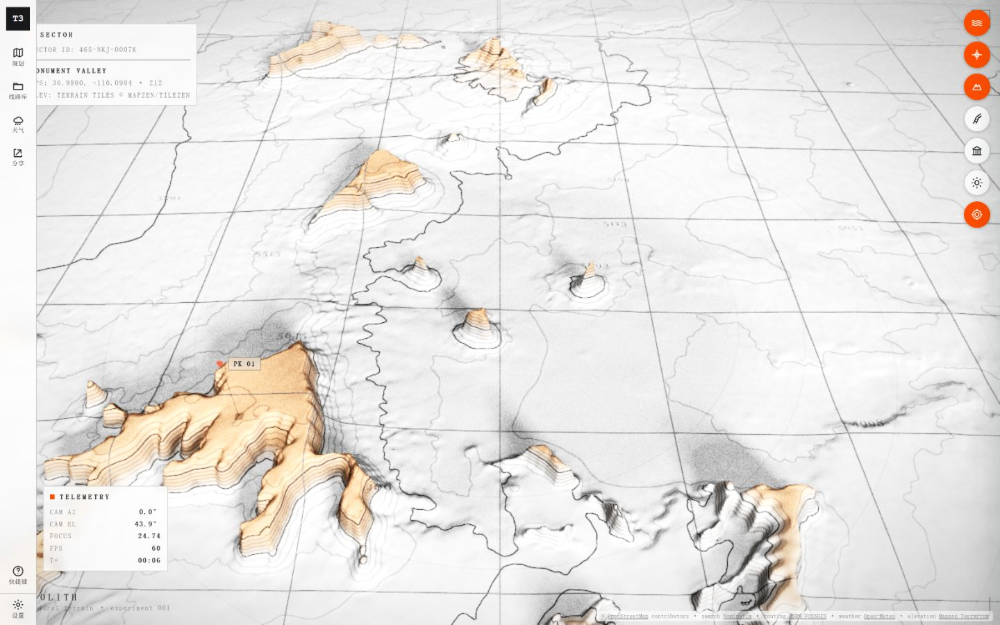
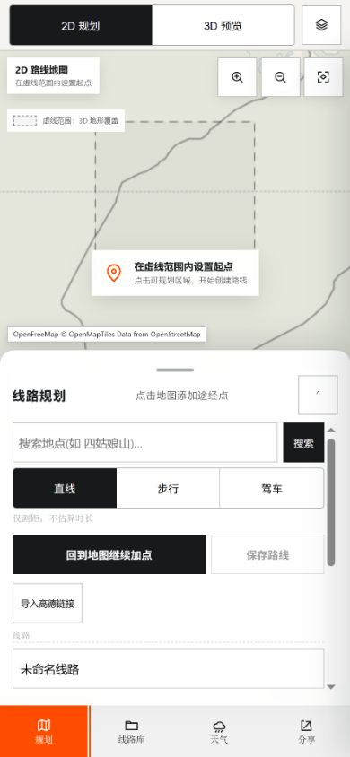

# TRIP 3D map-centered experience audit

## Audit scope

Combined UX and visible-accessibility review of the deployed overview and the
primary route-planning workspace. The reference is Windy's map-centered
interaction hierarchy, not its brand, palette, or exact component arrangement.

## User goal and accessibility target

The user needs to plan or load a trip and understand its time, spatial, terrain,
and weather context while keeping the map continuously legible. Controls must
remain discoverable on desktop and usable at 390px without requiring color alone
or hiding the map behind several simultaneous surfaces.

## Captured steps

### 1. Desktop overview

**Health: mixed.** The terrain rendering is distinctive and the map receives most
of the viewport. The left rail, upper-left sector HUD, lower-left telemetry, and
right-side layer buttons nevertheless read as separate interface islands. Their
hierarchy does not reveal a primary planning or recording action.

### 2. Mobile route planning

**Health: weak but recoverable.** The map remains visible and the bottom sheet is
technically usable, but the top view switch, map controls, empty-state prompt,
sheet header, search, mode selector, two actions, route name, scrollbar, and
bottom navigation all compete in one viewport. The user's next action is repeated
in several places instead of being made singular and obvious.

## Strengths

- The underlying terrain is memorable and already capable of carrying the brand.
- Route editing, 2D/3D viewing, weather, layers, profile, and sharing already have
  real implementation seams; the redesign does not need to invent a demo product.
- The mobile sheet, map view switch, focus styles, accessible names, and reduced
  motion hooks provide useful foundations.
- The current planning workspace already moves toward a full-width map rather
  than placing the map inside a dashboard card.

## UX risks

1. **The product reads as a terrain experiment before it reads as a trip tool.**
   `MONOLITH`, telemetry, sector copy, and experimental settings outrank the
   user's planning and recording goal.
2. **Global chrome and contextual controls are mixed.** Planning, library,
   weather, share, map layers, terrain controls, and diagnostics use different
   shapes and anchors without a clear hierarchy.
3. **2D and 3D appear to be separate modes.** The interface language emphasizes
   switching workspaces rather than changing views of one shared trip.
4. **Time and climate are secondary panels.** Weather and trip chronology are not
   expressed as dimensions of the active route.
5. **Mobile repeats the same instruction.** Empty-state cards, sheet subtitles,
   action buttons, and map copy all explain how to add a point, increasing noise.
6. **The map lacks a persistent trip-state spine.** The route name, date/time,
   current position or segment, weather state, and save status do not form one
   coherent, glanceable model.

## Accessibility risks

- Several visible controls are icon-first or visually small; accessible names in
  the DOM do not guarantee adequate target size or discoverability.
- Fine gray type and hairline borders risk insufficient contrast over the bright,
  highly detailed terrain.
- Canvas content cannot carry all route, weather, and administrative meaning; the
  same state needs a structured textual outlet.
- Focus order, map-keyboard interaction, high zoom, screen-reader announcements,
  and touch gesture arbitration require implementation testing beyond screenshots.

## Opportunity areas

- Replace the inherited experiment framing with a single TRIP 3D trip-state
  header or command surface.
- Keep one continuous map canvas and let planning, route record, weather, and
  layers enter as contextual edge tools rather than peer applications.
- Treat 2D and 3D as view controls attached to the map, preserving route selection,
  camera intent, time, weather, and edit state.
- Add a time-and-climate spine tied to route distance and segments, capable of
  showing day boundaries, forecast availability, and selected conditions.
- On mobile, permit only one primary bottom sheet at a time and collapse it to a
  useful trip summary rather than a generic grabber.
- Reserve strong color for route, selection, weather severity, and the primary
  action; reduce decorative diagnostic emphasis.

## Evidence limits and verification gaps

- Screenshots and a read-only DOM inspection support this baseline; they do not
  establish WCAG conformance.
- The deployed site was used because the local dependency installation does not
  currently contain `maplibre-gl`. No dependency was installed or changed during
  this audit.
- Forecast accuracy, provider availability, IndexedDB migration behavior, GPX
  fidelity, and full keyboard/touch flows were outside this visual baseline.

## Recommendations

1. Select one replacement visual and interaction direction before implementation.
2. Write the selected map-workspace brief without duplicating global product
   facts or future design tokens.
3. Implement the redesign as one bounded `/goal`, preserving current route and
   storage semantics.
4. Validate the resulting map, planning, weather, record, empty, loading, and
   failure states on desktop and 390px mobile.
5. Create `DESIGN.md` from the verified implementation so the document records
   the system that actually shipped.
