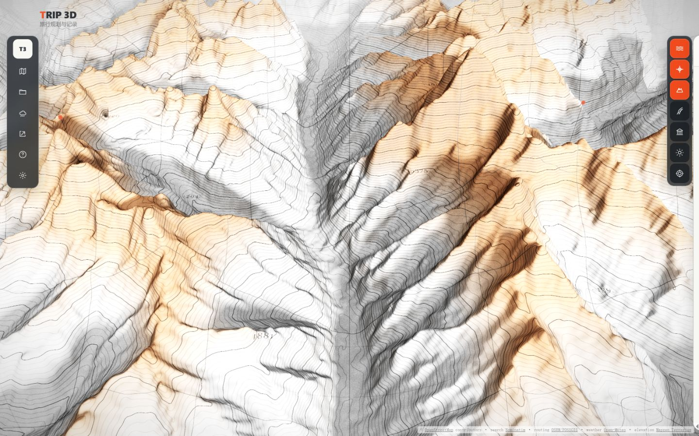
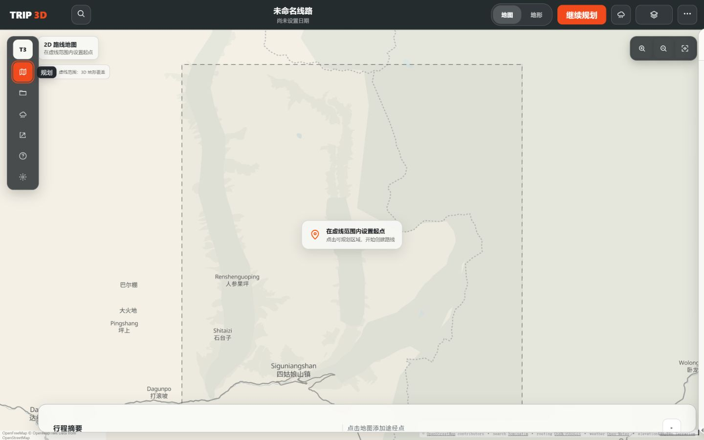
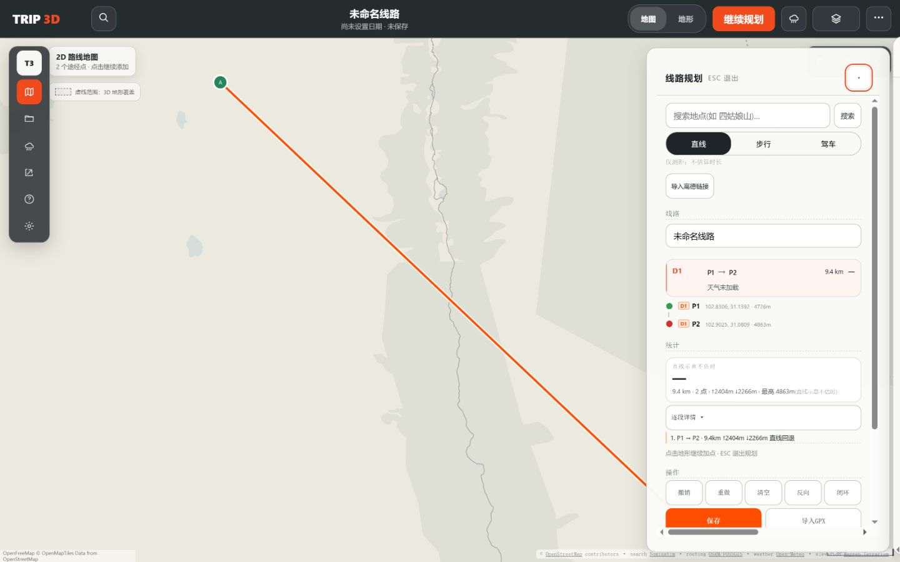
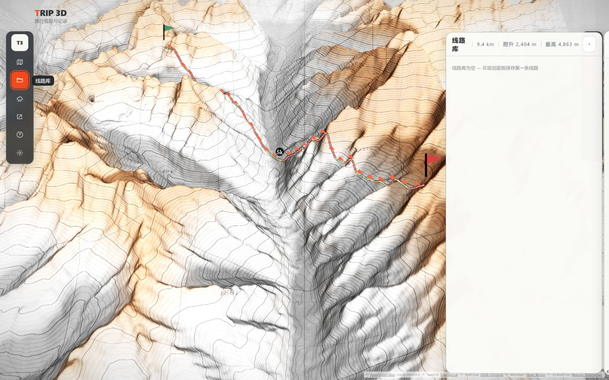
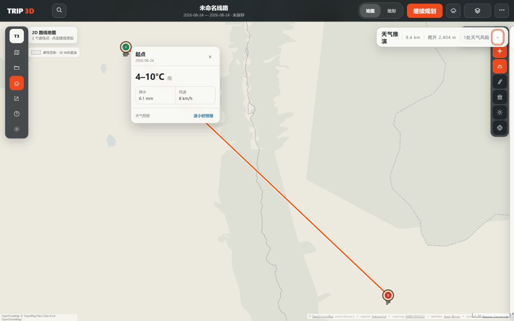
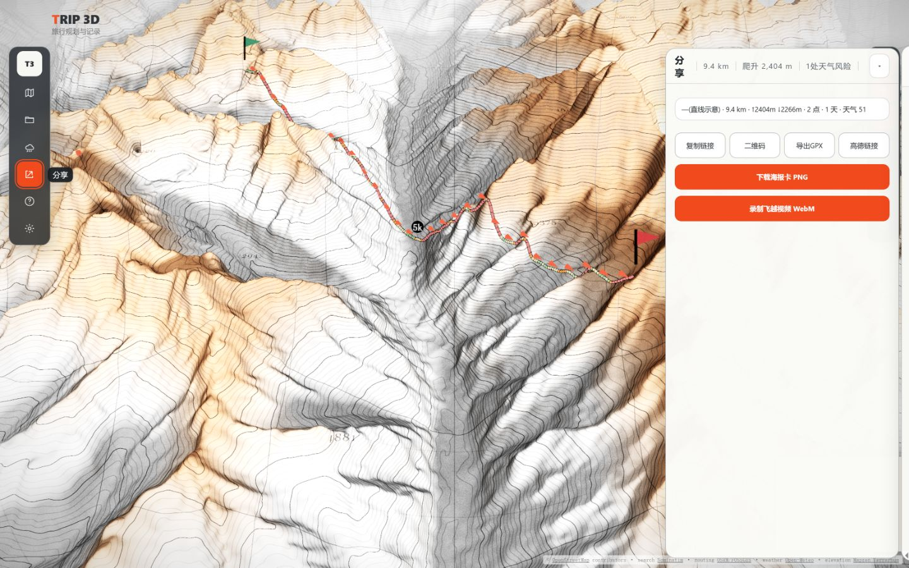
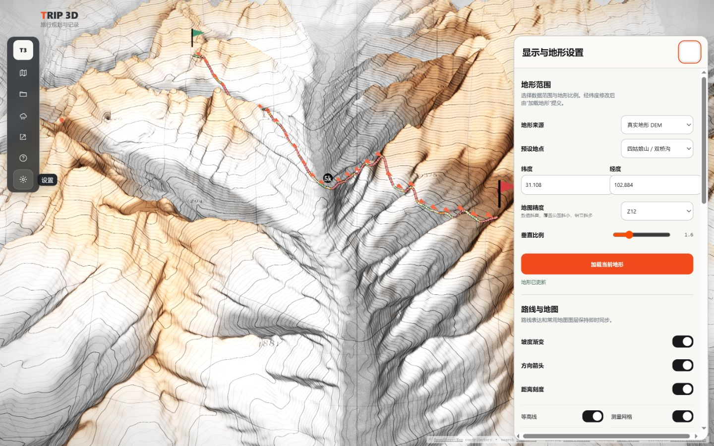
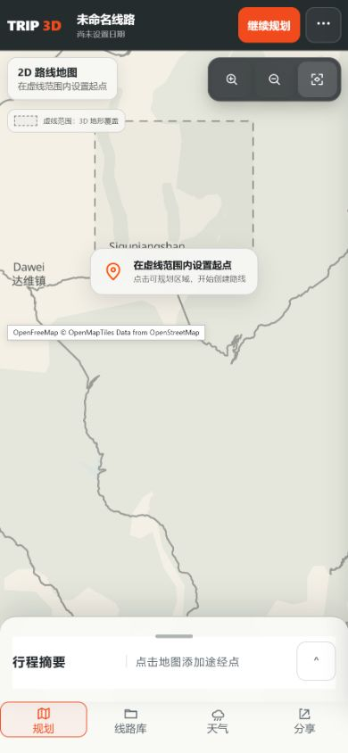
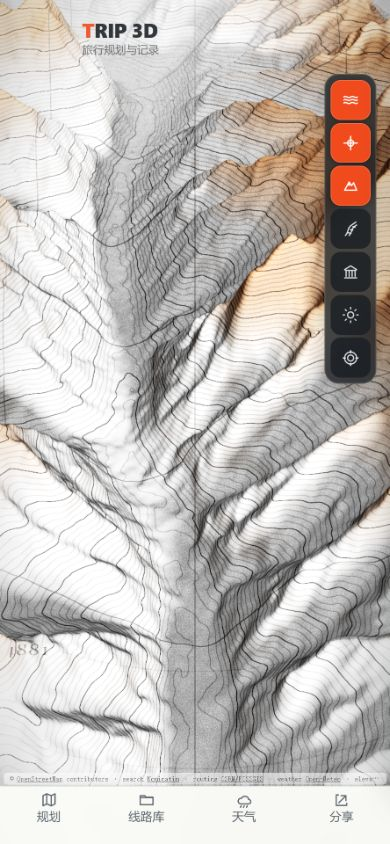

# TRIP 3D new-user core-flow audit

## Audit scope

Combined UX and visible-accessibility audit of production deployment
`72b70fe8.trip-3d.pages.dev` from a new origin with no saved trip. The flow used
the in-app browser's Playwright surface for semantic controls and screenshots,
with coordinate interaction only for map point placement.

## User goal and accessibility target

A first-time visitor should understand how to begin a trip, add a route, change
map view, inspect weather, save or share, and recover from empty states. Controls
must have stable accessible names, panels must announce their true state, and
mouse, touch, and keyboard paths must not diverge.

## Captured steps

### 1. Desktop overview — mixed

The terrain leads strongly, but the first action is implicit. The desktop rail
uses icon-only buttons whose labels appear visually on hover; most buttons had no
accessible name in the current semantic snapshot. Three orange layer controls
compete with route orange before a trip exists.

### 2. Empty planning — mixed

The map instruction is understandable, but **继续规划** is redundant while the
user is already planning and only expands the drawer. Search exists both in the
top bar and the drawer. The terrain-coverage boundary is visible but its product
meaning and recovery are not obvious until failure.

### 3. Planning drawer — weak

The drawer repeats route summary, D1 row, waypoint list, aggregate statistics,
leg details, instructions, actions, and profile. It has a visible horizontal
scrollbar and the save/import row is clipped at the bottom, making the primary
editing surface feel unfinished.

### 4. Empty library — weak

The empty message explains that saving is required but offers no direct action.
Moving from planning to library replaces the MapLibre workspace and command bar
with the legacy terrain scene, breaking the product's one-trip/one-map model.
Route metrics remain in the empty-library header and add noise.

### 5. Weather query and point card — mixed

The route-linked temperature card is compact and useful. However, its
**逐小时预报** button currently closes weather mode and returns to the legacy
terrain view instead of showing hourly detail. This is a confirmed false
affordance.

### 6. Share — mixed

All export paths are reachable, but two full-width orange actions compete as
primary. Link, QR, GPX, Amap, poster, and video are presented without explanatory
grouping. The surface also returns to the legacy terrain world.

### 7. Desktop settings — weak

The close control is visibly blank because its glyph is hidden by a broad style
rule. A horizontal scrollbar appears at the bottom. Native settings and retained
legacy controls remain mounted together; even while closed, the browser's
semantic DOM snapshot contained the full settings tree. This is not proof of
screen-reader exposure, but it is confirmed DOM and performance overhead and
requires an accessibility-tree check after repair.

### 8. Mobile planning — mixed

The map and bottom navigation reflow without horizontal page overflow. The sheet
looks like a 96px summary state, while its accessible labels announce
**当前半屏 / 展开到全屏**. The visual and semantic state machines disagree.

### 9. Mobile overview — mixed

The terrain remains legible, but the right-side seven-button layer stack consumes
substantial width and three active orange controls dominate the first viewport.
Settings are not reachable from the bottom navigation until the user enters
planning and opens **更多**.

### 10. Mobile more and settings — mixed

The more menu is clear. Settings cover the working surface as expected, but the
close button is blank, the underlying **继续规划** remains visually active, and
the settings body has both vertical and horizontal scrolling.

## Highest-impact findings

1. **P0 — Hourly weather action is broken:** clicking it exits weather mode.
2. **P0 — Desktop rail loses accessible names:** hidden labels leave most buttons
   unnamed outside hover/active state.
3. **P1 — Core surfaces do not share one map workspace:** library, share, and
   settings jump back to legacy terrain and remove the command bar.
4. **P1 — Planning drawer overflows and duplicates information:** horizontal
   scrolling and clipped actions are visible at 1440px.
5. **P1 — Mobile sheet state is false:** visual summary is announced as half.
6. **P1 — Settings close control is blank and closed settings stay mounted:**
   horizontal overflow and unnecessary semantic/DOM weight remain.
7. **P1 — Empty library lacks recovery:** no direct plan/save action.
8. **P2 — Share hierarchy is unclear:** two primary actions and no grouping.
9. **P2 — First viewport depends on icon interpretation:** new users have no
   explicit start action on the overview.

## Performance evidence

- Production DOMContentLoaded delta: approximately 2.14s in the audited session.
- Live renderer: 60fps; terrain custom layer approximately 0.12ms average and
  1.2ms maximum; no sustained rendering lag observed.
- DOM snapshot: roughly 2,743 nodes and about 19.5MB JS heap in the weather state.
- A collapse+expand pair in a 360ms window consumed about 298ms task time versus
  93ms for an idle window of equal length. Layout was only about 1ms, indicating
  a bounded script/rendering spike rather than layout thrash. The browser-driving
  overhead means this is a prioritization signal, not a standalone regression
  benchmark.

## Evidence limits

- Screenshots and semantic snapshots do not establish full WCAG conformance.
- Pointer weather hover, real forecast retrieval, keyboard-visible weather points,
  and responsive reflow were exercised. Screen-reader output and OS-level high
  contrast were not tested.
- No data deletion, saved-route mutation, deployment, or production write was
  performed during the audit.

## Recommended goal

Repair the first-time core journey without redesigning product identity or data
semantics: keep every core surface on the shared MapLibre workspace; restore
accessible navigation and true panel state; simplify the planning drawer; make
hourly weather truthful; fix settings overflow/close behavior and lazy presence;
and add direct empty-state recovery. Validate desktop and 390px with focused
tests, Playwright screenshots, keyboard checks, and bounded performance evidence.

## Local repair verification

The approved repair was implemented and verified in a local worktree based on
`b55dc9bed765128464c8be1d9b333cf61a500407`. No deployment, push, pull request,
production write, provider replacement, or storage-schema change was performed.

| Finding | Status | Local evidence |
| --- | --- | --- |
| Hourly weather action exits weather | closed | A route-bound query returned 24 hourly rows; clicking **逐小时预报** kept `weather-operate`, the weather panel, command bar, and one visible MapLibre canvas active. See [desktop hourly weather](../../.impeccable/audits/new-user-2026-08-24-after/03-weather-hourly-desktop.png). |
| Desktop rail controls lose names | closed | Every rail button exposes a stable name: 规划、线路库、天气、分享、快捷键、设置. Focused regression coverage asserts the names independent of visual labels. |
| Library, share, and settings leave the shared map | closed | Desktop and 390px runtime checks kept the command bar visible, `#app` hidden, and one MapLibre canvas active across all three surfaces. See [empty library](../../.impeccable/audits/new-user-2026-08-24-after/02-library-desktop.png), [grouped share](../../.impeccable/audits/new-user-2026-08-24-after/04-share-desktop.png), and [desktop settings](../../.impeccable/audits/new-user-2026-08-24-after/05-settings-desktop.png). |
| Planning drawer duplicates and clips content | closed | Drawer search was removed in favor of the command bar; the single-day row is suppressed; secondary edit/import actions are disclosed; save remains visible. Desktop panel and page horizontal overflow both measured 0px. See [desktop planning](../../.impeccable/audits/new-user-2026-08-24-after/01-planning-desktop.png). |
| Mobile sheet announces a false state | closed | Runtime measurements now agree: peek 96px / `当前摘要`, half 397px / `当前半屏`, full 730px / `当前全屏`; each state had 0px horizontal overflow. See [mobile summary](../../.impeccable/audits/new-user-2026-08-24-after/06-planning-mobile.png) and [mobile full](../../.impeccable/audits/new-user-2026-08-24-after/07-planning-mobile-full.png). |
| Settings close is blank; closed settings stay mounted | closed | The close glyph is visible; desktop and mobile drawer overflow measured 0px. Closing removes native and legacy controls: drawer children 0, settings controls 0, stray GUI 0. See [mobile settings](../../.impeccable/audits/new-user-2026-08-24-after/08-settings-mobile.png). |
| Empty library has no recovery | closed | Empty state now exposes **开始规划**, which enters the same map-centered planning workspace. |
| Share actions have competing hierarchy | closed | Share is grouped as 发送行程、导出与互通、留存画面, with **复制分享链接** as the only filled primary action. |
| First viewport depends on layer icons and strong active states | closed | The command bar and **继续规划** are present from the default viewport; the seven layer tools are closed by default and their selected treatment is restrained. Desktop and mobile page overflow measured 0px. |

### Validation evidence

- `npm test`: 43 files, 275 tests passed.
- `npm run build`: passed with Vite 6.4.3; the existing large-chunk advisory remains non-blocking.
- Desktop and 390px used separate local origins (`127.0.0.1:4174` and
  `localhost:4174`) with the in-app Browser Playwright surface.
- Desktop 2D/3D switching retained one MapLibre canvas and kept the legacy
  Three container hidden.
- The planning panel contained 50 descendant nodes in the tested empty state.
  A 360ms collapse/expand measurement consumed about 50.3ms TaskDuration versus
  31.6ms for the same-length idle window, down from the original audit's
  approximately 298ms versus 93ms prioritization signal. Browser-driving
  overhead still makes this comparative evidence rather than a standalone lab
  benchmark.
- Closed settings returned the tested document from 1,234 nodes while open to
  405 nodes on desktop, with no retained settings controls in the document.
